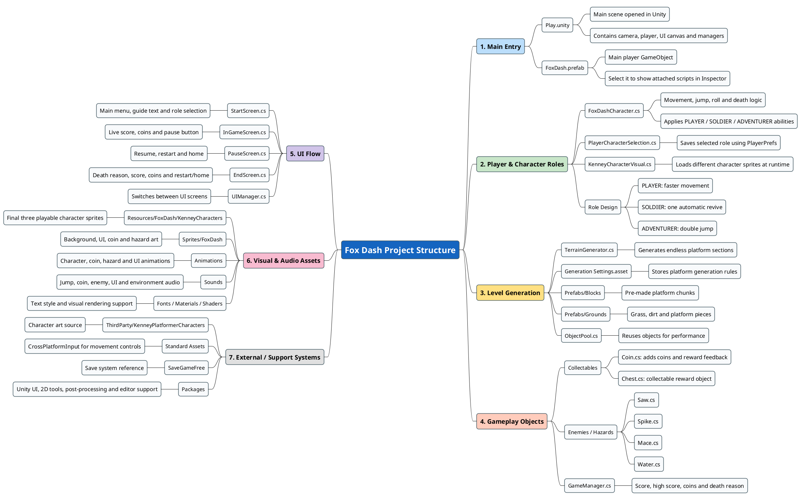

# Fox Dash Simple Project Structure Mind Map

This is a simplified version for presentation. It focuses on the main file groups and how they work together.

```plantuml
@startmindmap
<style>
mindmapDiagram {
  node {
    FontName Arial
    FontSize 16
    BackgroundColor #F8FAFC
    LineColor #455A64
    RoundCorner 12
  }
  :depth(0) {
    BackgroundColor #1565C0
    FontColor white
    FontStyle bold
    FontSize 24
  }
  :depth(1) {
    FontStyle bold
    FontSize 18
  }
  :depth(2) {
    FontSize 15
  }
}
</style>

* Fox Dash Project Structure
**[#BBDEFB] 1. Main Entry
*** Play.unity
**** Main scene opened in Unity
**** Contains camera, player, UI canvas and managers
*** FoxDash.prefab
**** Main player GameObject
**** Select it to show attached scripts in Inspector

**[#C8E6C9] 2. Player & Character Roles
*** FoxDashCharacter.cs
**** Movement, jump, roll and death logic
**** Applies PLAYER / SOLDIER / ADVENTURER abilities
*** PlayerCharacterSelection.cs
**** Saves selected role using PlayerPrefs
*** KenneyCharacterVisual.cs
**** Loads different character sprites at runtime
*** Role Design
**** PLAYER: faster movement
**** SOLDIER: one automatic revive
**** ADVENTURER: double jump

**[#FFE082] 3. Level Generation
*** TerrainGenerator.cs
**** Generates endless platform sections
*** Generation Settings.asset
**** Stores platform generation rules
*** Prefabs/Blocks
**** Pre-made platform chunks
*** Prefabs/Grounds
**** Grass, dirt and platform pieces
*** ObjectPool.cs
**** Reuses objects for performance

**[#FFCCBC] 4. Gameplay Objects
*** Collectables
**** Coin.cs: adds coins and reward feedback
**** Chest.cs: collectable reward object
*** Enemies / Hazards
**** Saw.cs
**** Spike.cs
**** Mace.cs
**** Water.cs
*** GameManager.cs
**** Score, high score, coins and death reason

left side

**[#D1C4E9] 5. UI Flow
*** StartScreen.cs
**** Main menu, guide text and role selection
*** InGameScreen.cs
**** Live score, coins and pause button
*** PauseScreen.cs
**** Resume, restart and home
*** EndScreen.cs
**** Death reason, score, coins and restart/home
*** UIManager.cs
**** Switches between UI screens

**[#F8BBD0] 6. Visual & Audio Assets
*** Resources/FoxDash/KenneyCharacters
**** Final three playable character sprites
*** Sprites/FoxDash
**** Background, UI, coin and hazard art
*** Animations
**** Character, coin, hazard and UI animations
*** Sounds
**** Jump, coin, enemy, UI and environment audio
*** Fonts / Materials / Shaders
**** Text style and visual rendering support

**[#E0E0E0] 7. External / Support Systems
*** ThirdParty/KenneyPlatformerCharacters
**** Character art source
*** Standard Assets
**** CrossPlatformInput for movement controls
*** SaveGameFree
**** Save system reference
*** Packages
**** Unity UI, 2D tools, post-processing and editor support

@endmindmap
```
